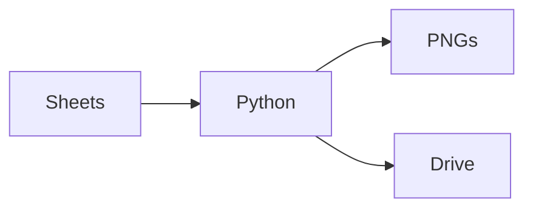

# English Class Automation System


## 🌟 Features

### Data Pipeline
- Dynamic CSV export from Google Sheets
- Holiday-aware scheduling
- Bilingual date handling (English/Spanish)

### Google Drive Integration
- OAuth2 authenticated uploads
- Automatic month/year folder creation
- Conflict-resistant file management

### Invoice Generation
- PDF creation with professional typography
- Automatic totals calculation
- Clean template design

## 🛠 Tech Stack


# 🚀 Usage
## Run with specific month/year
```shell
python main.py -m 8 -y 2025
```
### Auto-detect current month
```shell
python main.py
```


## 📂 File Structure
/ (root)
├── Invoices/           # Generated PNGs
├── logs/               # Execution logs
├── auth/               # OAuth credentials
├── main.py             # Core pipeline
├── preparation.py      # Sheets exporter
└── upload.py           # Drive uploader